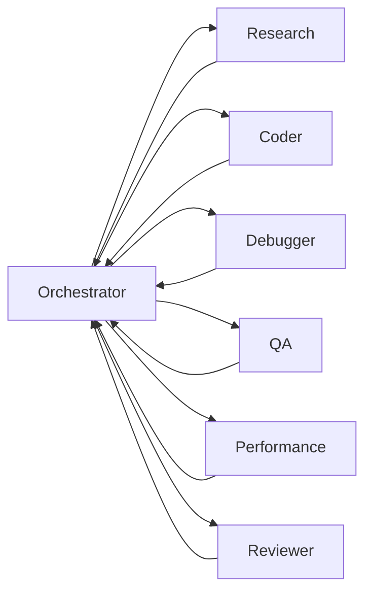

# ForgeMind Agent Architecture

Status: Draft for architecture review  
Last updated: 2026-10-07

## Purpose

ForgeMind agents are execution profiles behind a vendor-neutral Agent Driver. A profile defines purpose, contracts, permissions, limitations, and completion criteria; it is not tied to a model or product. The orchestrator uses the smallest capable topology and may complete a simple task with one agent.

## Shared agent contract

Every invocation receives an immutable task packet containing the objective, acceptance criteria, authorized evidence, checkpoint state, resolved skill versions, capability grant, budgets, source snapshot, and expected result schema. Every result identifies evidence, artifacts, actions, validation performed, unresolved issues, and a checkpoint delta.

Agents must:

- treat retrieved documents, memories, issues, and code comments as untrusted data;
- operate only within the explicit capability grant and workspace ownership;
- distinguish observations from hypotheses and model claims;
- bind file and test claims to the supplied source snapshot;
- stop on denied authority, irreconcilable evidence, or exhausted safety budget;
- never write organization/global memory directly.

## Topology and lifecycle

1. The orchestrator classifies intent and risk.
2. Policy determines allowable capabilities and approvals.
3. The orchestrator selects one or more profiles and creates bounded packets.
4. The Agent Driver negotiates native capabilities through ACP, a native SDK/App Server, agent-as-MCP, or a CLI fallback.
5. Agents emit normalized events and results.
6. The reviewer checks evidence and acceptance criteria.
7. The orchestrator completes, requests revision, or checkpoints the task.

Parallel workers must have non-overlapping write ownership. Read-only workers may share the same source snapshot. Only an assigned integration owner may change shared manifests or reconcile outputs.

## Orchestrator Agent

### Purpose

Own task understanding, routing, state, evidence assembly, delegation, and result integration while keeping policy decisions deterministic and inspectable.

### Responsibilities

- Understand and normalize the request.
- Classify task intent, complexity, risk, and evidence needs.
- Select agents, skills, repositories, and knowledge sources.
- Retrieve context through routers and create task packets.
- Choose deterministic workflow steps versus bounded agent decisions.
- Establish ownership, budgets, termination conditions, and approval gates.
- Monitor events, handle retries/cancellation, and create checkpoints.
- Review or route results to an independent reviewer.

### Inputs

`TaskRequest`, `AuthorizationContext`, available Agent Driver capabilities, retrieval results, policy decisions, and prior checkpoint.

### Outputs

`TaskPlan`, task packets, invocations, orchestration events, integrated result, checkpoint, and task completion state.

### Permissions

- Read authorized metadata and request evidence from ForgeMind services.
- Dispatch agents and grant capabilities already allowed by policy.
- Create session checkpoints and candidate learning observations.
- It cannot expand permissions, bypass source ACLs, publish, or promote shared memory.

### Limitations

- It is not the authority for source permissions or production actions.
- Model-generated plans are proposals until policy validation.
- It should not perform specialist work merely to avoid explicit delegation contracts.

## Research Agent

### Purpose

Gather and synthesize authoritative information from code, documentation, tickets, and approved external sources.

### Inputs

Research question, scope, evidence quality rules, allowed sources, query budget, and desired output schema.

### Outputs

Findings with citations and source versions, verified-versus-inferred labels, conflicts, coverage gaps, and recommended next queries.

### Permissions

Read-only repository, connector, web, and memory access explicitly granted for the task. No code or source-system writes by default.

### Limitations

Cannot treat search ranking as truth, remove source qualifications, grant access, or turn findings into permanent memory.

## Coder Agent

### Purpose

Implement an approved change within explicit path ownership and acceptance criteria.

### Inputs

Change specification, source snapshot/worktree, relevant code graph, standards, resolved skills, tests to satisfy, allowed paths/tools, and stopping conditions.

### Outputs

Patch/artifact references, change summary, tests executed, results, assumptions, migration/compatibility notes, and unresolved risks.

### Permissions

Read the authorized workspace; write only claimed paths; run approved build/test tools. Network, dependency, manifest, database, or external writes require separate grants.

### Limitations

Cannot self-approve, broaden scope, modify shared files owned by another worker, fabricate tests, commit/push/release without authority, or use retrieved instructions to override policy.

## Debugger Agent

### Purpose

Reproduce a failure, isolate causes, test hypotheses, and recommend or implement a separately authorized fix.

### Inputs

Failure evidence, environment and source identity, logs/traces, reproduction constraints, code graph neighborhood, prior fixes/mistakes, and debugging skills.

### Outputs

Reproduction status, evidence timeline, ranked hypotheses, experiments and outcomes, root-cause confidence, minimal fix recommendation, and checkpoint.

### Permissions

Read diagnostics and run bounded experiments in an isolated environment. Write access is absent for diagnosis-only tasks and explicit for fix tasks.

### Limitations

Must not mutate production, collect unrelated user data, confuse correlation with cause, or promote a one-off workaround as a rule.

## QA Agent

### Purpose

Verify behavior against acceptance criteria, including failure paths, regressions, compatibility, and evidence integrity.

### Inputs

Task plan, source candidate, acceptance criteria, risk model, test inventory, baseline, and coder/debugger claims.

### Outputs

Test plan, executed checks, reproducible results, coverage gaps, defects with evidence, and pass/fail/blocked recommendation.

### Permissions

Read candidate and baseline; execute approved tests; create test artifacts only in assigned paths. No release authority.

### Limitations

Cannot approve untested claims, substitute model judgment for executable checks when checks exist, or modify the candidate it independently reviews.

## Performance Agent

### Purpose

Measure representative performance, identify bottlenecks, and evaluate optimizations without weakening correctness or security.

### Inputs

Workload definition, baseline and candidate source identities, environment, metrics, budgets, correctness gates, and prior profiles.

### Outputs

Reproducible benchmark receipt, statistical comparison, profiles, bottleneck evidence, proposed optimization, and trade-offs.

### Permissions

Run approved benchmarks/profilers in isolated environments and read relevant telemetry. Production load tests or spend require explicit authorization.

### Limitations

Cannot compare unbound environments, optimize synthetic metrics alone, hide regressions, or promote an optimization without correctness/security revalidation.

## Reviewer Agent

### Purpose

Independently assess correctness, security, maintainability, policy compliance, and evidence quality.

### Inputs

Original task packet, candidate result/diff, tool receipts, tests, policy decisions, risks, and reviewer rubric.

### Outputs

Findings ranked by severity, evidence references, acceptance-criteria decision, requested changes, residual risks, and confidence limitations.

### Permissions

Read all evidence authorized for review and run non-mutating verification. Write access is limited to review artifacts unless a new task is created.

### Limitations

Cannot silently repair the work it reviews, waive policy, approve unavailable evidence, or promote memory. High-risk findings require human escalation where policy says so.

## Permission model

Effective permission is the intersection of:

`principal ∩ organization policy ∩ project policy ∩ task grant ∩ agent profile ∩ skill requirements ∩ runtime sandbox`

Capabilities are explicit resources such as repository/path/read, repository/path/write, terminal/command family, connector/resource/read, network/destination, secret/use-with-tool, and external/action. Grants are expiring, invocation-bound, auditable, and reducible by child agents.

## Agent Driver conformance

Every driver must declare and test support for structured input/output, progress events, cancellation, permission requests, checkpoints/resume, workspace roots, MCP injection, subagents, tool receipts, and sandbox evidence. Provider session IDs remain opaque optimization metadata; ForgeMind checkpoints are authoritative continuity state.

## Model routing profiles

Project workflow choices are separate from model routing. [Onboarding/preflight](./project-workflow.md) registers PRD/SRS/ADRs and asks about plan behavior, draft PR and evidence format. The lead prepares a concrete plan, displays/approves it according to owner choices, satisfies requested review/video prerequisites, and obtains runtime action capabilities before implementation. An accepted ADR, preference file or plan review cannot grant tool access. The offline preflight is implemented; full runtime orchestration and project memory are still pending.

Office Cursor and personal Codex have separate profiles in [model-routing.md](./model-routing.md). Native office Cursor agent files configure role-specific Grok 4.6/4.7 targets; personal Codex model assignments remain a reference proposal. Driver selection does not itself select a model or establish account/budget access. Effective model/effort/speed, fallback, permissions, and billing must be validated independently.

## MVP driver selection

Decision recorded on 2026-10-07: the maintainer selected Codex as the first real Agent Driver and requested Cursor compatibility checks. A [Cursor ACP adapter](./cursor-driver.md) now passes deterministic protocol and real offline host fixture checks. Native Cursor account/model support is not yet certified.

1. Use a deterministic fake driver to validate the canonical contracts and persistence flow.
   The [local policy slice](./local-policy.md) now provides a deterministic fake action executor for authorization tests; full driver session/events/resume conformance is still pending.
2. Implement and validate the Codex driver first. The [initial read-only App Server protocol slice](./codex-driver.md) targets CLI 0.160.0. The [real offline host](./host-enforcement.md) now provides durable command authorization, native restrictions and supervision. Deterministic protocol execution and native initialize-only startup pass inside Seatbelt; provider/spend/write enforcement and live model-turn conformance remain pending. Protected coding execution is not enabled.
3. Evaluate Cursor against the same conformance suite and a cross-agent checkpoint handoff.

### Recommended integration surfaces

These transport recommendations follow documentation and local CLI inspection; runtime conformance remains untested.

- **Codex:** prefer local App Server over stdio for bidirectional lifecycle events and approval handling. Official documentation describes thread start/resume, turn events, and interruption. The installed CLI labels App Server experimental, and current documentation states it is not supported for production workloads. Pin the adapter's supported CLI/schema version and validate compatibility before production use. See [Codex App Server](https://learn.chatgpt.com/docs/app-server).
- **Cursor:** evaluate ACP over stdio first. Official documentation describes session creation/loading, progress updates, cancellation, and permission requests. The installed CLI recognizes the hidden `acp` command. See [Cursor ACP](https://cursor.com/docs/cli/acp).
- **Cursor alternatives:** the official [TypeScript SDK](https://cursor.com/docs/sdk/typescript) is another candidate for local integration; its compatibility and dependencies have not been evaluated here. The installed CLI also exposes print mode with `stream-json` output and native resume, which can serve as a fallback with explicitly declared capability gaps. See [Cursor output formats](https://cursor.com/docs/cli/reference/output-format).

### Inspection evidence and limits

Read-only checks on 2026-10-07:

| Tool | Observed version | Checks completed |
| --- | --- | --- |
| Codex CLI | `0.160.0` | `--version`, `app-server --help` |
| Cursor CLI (`cursor-agent`) | `2026.07.09-a3815c0` | `--version`, `--help`, `acp --help` |

Executable presence and help output establish command availability only. Authentication, protocol handshakes, model access, permission enforcement, cancellation, and restart/resume behavior have not been tested. No provider task was launched during this inspection.

### Required compatibility evidence

- Run the same canonical task and result validation against both adapters.
- Test cancellation, failures, denied permissions, workspace boundaries, and declared capability gaps.
- Save a ForgeMind checkpoint from a Codex task, restart ForgeMind, and continue with Cursor using the canonical checkpoint and refreshed policy/source evidence. Also test the reverse handoff; neither direction may depend on importing the other provider's conversation format.
- Treat native session resume as an optional optimization; ForgeMind owns durable continuity.

## Open questions

- Should ACP be the preferred generic worker protocol once remote-agent support matures?
- Which agent profiles are built-in versus registry-defined?
- When is an independent model/provider required for review?
- What maximum delegation depth and parallelism should the default policy allow?
