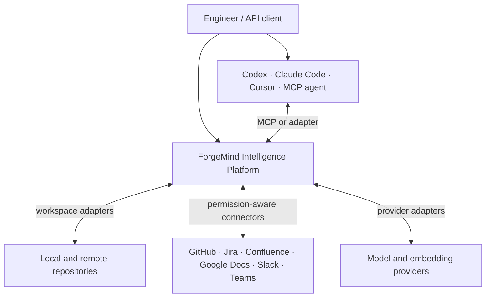
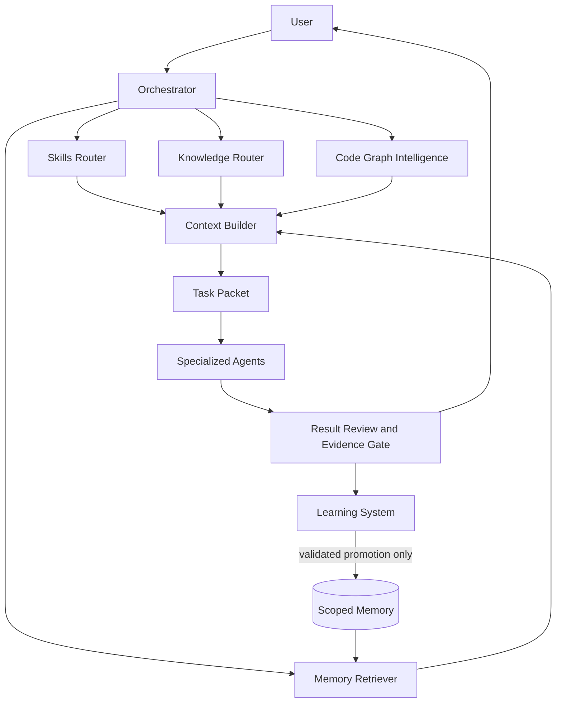
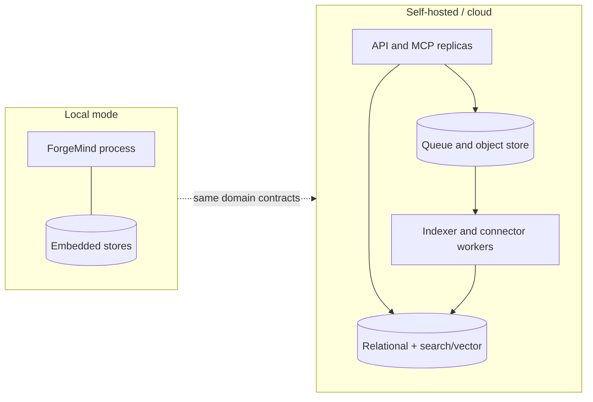

# ForgeMind Architecture Design

Status: Draft for architecture review  
Version: 0.1  
Last updated: 2026-08-23

## Executive summary

ForgeMind is a repository-independent engineering intelligence and orchestration control plane. It sits beside coding agents, not inside any one of them. Its core accepts a task, derives an authorization and intent envelope, retrieves the smallest sufficient evidence from skills, organizational knowledge, code intelligence, and scoped memory, then emits a portable task packet for a selected agent runtime. Results become reviewable observations; only validated, scoped lessons become durable memory.

The architecture is built around protocol-neutral domain contracts with MCP at the edge. ForgeMind can therefore both expose intelligence to MCP hosts and consume optional MCP servers without allowing the protocol, a vendor SDK, or a repository layout to become its internal model.

## Architectural drivers

- Agent independence across Codex, Claude Code, Cursor, and future MCP-compatible agents.
- Repository independence across local worktrees and remote Git providers.
- Strict organization, project, principal, and source-ACL isolation.
- Context efficiency and predictable evidence budgets.
- Durable task state and recoverable checkpoints.
- Conservative, attributable learning.
- Local-only through horizontally scalable cloud deployment.
- Pluggable code analyzers, embedding models, stores, agent runtimes, and connectors.
- Observable decisions without requiring storage of private reasoning or complete conversations.

## System context



ForgeMind owns intelligence assembly, orchestration state, retrieval policy, checkpoints, and curated memory. Coding agents own their native editing, terminal, sandbox, and user-interaction experience. Source systems remain authoritative for their content and permissions.

## High-level architecture



## Logical planes and bounded contexts

```mermaid
flowchart LR
    subgraph Experience[Experience and Protocol Edge]
      CLI[CLI / local API]
      MCPH[MCP host facade]
      SDK[SDK / HTTP API]
    end

    subgraph Control[Orchestration Control Plane]
      Intake[Task intake]
      Intent[Intent classifier]
      Planner[Planner and policy engine]
      Runtime[Workflow runtime]
      Adapters[Agent adapters]
    end

    subgraph Intelligence[Intelligence Plane]
      SR[Skill resolver]
      KR[Knowledge retrieval]
      CG[Code graph]
      MR[Memory retrieval]
      CB[Context builder]
    end

    subgraph LearningPlane[Learning and Memory Plane]
      Observe[Observation pipeline]
      Validate[Validation and promotion]
      Store[Scoped memory store]
    end

    subgraph Integration[Integration Plane]
      Connectors[Source connectors]
      MCPC[MCP clients]
      Workspace[Workspace adapters]
    end

    Experience --> Control
    Control --> Intelligence
    Intelligence --> Control
    Control --> LearningPlane
    Integration --> Intelligence
    LearningPlane --> Intelligence
```



The bounded contexts exchange versioned contracts and do not query each other's storage directly. In particular, the orchestrator cannot bypass retrieval policy, connectors cannot write memory, and the learning system cannot alter authorization policy.

## Components and responsibilities

### Protocol edge

**MCP host facade** exposes ForgeMind resources, prompts, and tools to compatible agents. Typical tools include task creation, context retrieval, checkpoint creation, resume, skill resolution, and result submission. The facade maps MCP messages to domain commands and never makes MCP payloads the persistence format.

**API/SDK/CLI** provide equivalent local and remote interfaces for agents that do not support MCP or for administrative workflows. Compatibility tests require equivalent authorization and task semantics across edges.

### Identity, policy, and tenancy

Creates an `AuthorizationContext` from the authenticated principal, organization, projects, workspace registrations, connector grants, purpose, and requested action. It enforces tenant boundaries, source ACL filters, tool capabilities, budgets, retention policy, and approval requirements. Deny is the default when identity or source visibility cannot be established.

### Orchestrator

The orchestrator owns the task state machine, not domain data. It:

- normalizes a request into a `TaskRequest`;
- classifies intent, risk, required capabilities, and likely evidence;
- creates a deterministic/agentic `TaskPlan` under policy;
- queries skills, knowledge, code, and memory through their routers;
- asks the context builder to create a task packet;
- selects an agent adapter and grants only required capabilities;
- records lifecycle events and durable checkpoints;
- submits results to validation and learning.

Policy and deterministic routing should decide known constraints. Model-based planning may propose choices but cannot grant itself authority.

### Skills router

Searches registries by capability, task intent, compatibility, trust, version constraints, platform, and required tools. It resolves an immutable skill version and returns metadata first; detailed instructions, references, examples, or assets load only when justified. See [skills.md](./skills.md).

### Knowledge router

Federates permission-aware retrieval across indexed connector content. It converts task intent into source-specific searches, filters candidates by stored and live ACLs, reranks evidence, and returns content excerpts with source versions and citations. It never treats indexed copies as the authorization authority. See [connectors.md](./connectors.md).

### Code graph intelligence

Maintains a per-workspace, per-revision graph of repositories without assuming a single path or Git host. Nodes may represent repositories, revisions, files, symbols, APIs, tests, owners, packages, services, commits, and findings. Edges include contains, imports, calls, implements, references, tests, owns, changes, and depends-on.

Language analyzers emit a common intermediate schema. Retrieval combines lexical search, symbols, graph expansion, version-aware metadata, and optional embeddings. Every result binds to an immutable content hash or repository revision plus dirty-worktree snapshot identity when applicable.

### Memory retriever

Queries only memory scopes available to the principal and task. It combines structured filters, full-text/semantic retrieval, graph relations, confidence, freshness, and negative evidence. It returns memory records with provenance and applicability, never hidden policy. See [memory.md](./memory.md).

### Context builder

Fuses and deduplicates retrieved evidence into a bounded, typed `TaskPacket`. It reserves budgets by category, prioritizes mandatory constraints and direct code evidence, compresses lower-ranked material, detects contradictions, and records why each item was included or excluded. See [context-engine.md](./context-engine.md).

### Agent adapter layer

Maps a canonical task packet, tool-capability grant, and expected output schema to an agent's native interface. Adapters are anti-corruption layers: provider-specific sessions, tool schemas, prompts, and events never leak into the core. An adapter reports capability negotiation, invocation identity, evidence, usage, result, and checkpoint events.

### Specialized agents

Research, coder, debugger, QA, performance, and reviewer roles are optional execution profiles, not hard-coded model identities. The orchestrator may use one agent or a bounded topology based on task complexity. Agents receive least privilege, isolated output ownership, termination criteria, and a shared task identifier. See [agents.md](./agents.md).

### Result review and evidence gate

Validates output shape, evidence references, policy compliance, task acceptance criteria, tool receipts, and claimed tests. It separates observed results from model claims. High-risk or conflicting results require human or independent-agent review before task completion.

### Learning system

Transforms completed task evidence into observations and candidate lessons. It scores novelty, recurrence, evidence quality, scope, and contradictions, then routes candidates through validation. It cannot promote policy or global knowledge on the basis of one interaction. See [learning.md](./learning.md).

### Memory store

Persists structured global, organization, project, and session records with different authorities, retention, encryption, and promotion rules. Full conversations are not permanent memory.

### Connector runtime

Runs connector-specific ingestion, normalization, change capture, tombstones, ACL updates, and retrieval. Credentials stay in a secret broker and are resolved at execution time. Connector workers are isolated by organization and source account.

### Observability and audit

Emits traces, metrics, and append-only audit events for task transitions, retrieval decisions, source/version identities, permission decisions, tool grants, checkpoints, agent results, memory mutations, and administrator actions. It avoids storing chain-of-thought and redacts configured sensitive content.

## Canonical domain contracts

All contracts are versioned, schema-validated, and serializable without embedding vendor classes.

| Contract | Required semantics |
| --- | --- |
| `TaskRequest` | Task ID, principal, organization/project/workspace refs, objective, constraints, requested mode, parent checkpoint |
| `AuthorizationContext` | Principal, tenant, roles, source grants, allowed capabilities, purpose, policy version, expiry |
| `TaskPlan` | Intent, risk, stages, selected capabilities, evidence queries, agent topology, budgets, approvals, completion criteria |
| `EvidenceItem` | Stable ID, type, excerpt/summary, source URI, content version/hash, ACL label, provenance, timestamp, relevance, retrieval reason |
| `TaskPacket` | Objective, constraints, plan, evidence sections, selected skills, checkpoint, capabilities, output contract, budgets, omissions |
| `AgentInvocation` | Agent adapter/version, packet hash, capability grant, workspace snapshot, deadline, parent span |
| `AgentResult` | Structured outcome, artifacts, evidence references, actions/tool receipts, validation claims, unresolved issues, checkpoint delta |
| `SessionCheckpoint` | Objective, inspected artifacts, decisions, failed approaches, hypotheses, next steps, source identities, packet lineage |
| `LessonCandidate` | Structured claim, evidence set, proposed scope, confidence features, counterevidence, validator state |
| `MemoryRecord` | Type, scope, subject, statement, applicability, provenance, confidence, lifecycle, ACL, supersession links |
| `PolicyDecision` | Decision, rule/version, principal, action/resource, conditions, reason, evidence, timestamp, expiry/fencing data |

Repository identifiers use logical `WorkspaceRef` and `RepositoryRef` values. Local absolute paths are adapter details and must not be durable cross-machine identity.

## Task packet

A task packet is the portable boundary between ForgeMind and an execution agent. It is immutable once invoked and content-addressed so results can bind to the exact context used.

```text
TaskPacket
├── identity: task, organization, project, workspace snapshot
├── objective and acceptance criteria
├── intent, risk, plan, and stopping conditions
├── mandatory constraints and policy receipts
├── checkpoint / known task state
├── code evidence
├── organizational knowledge evidence
├── scoped memory evidence
├── resolved skills and versions
├── granted tools/capabilities
├── expected result schema
├── token/time/cost budgets
└── omissions, conflicts, provenance, and packet hash
```

Secrets and raw connector credentials are never included. Tool capabilities reference brokered grants that are narrow, expiring, and bound to the invocation.

## End-to-end data flow

```mermaid
sequenceDiagram
    actor User
    participant Edge as MCP/API Edge
    participant Policy as Identity & Policy
    participant Orch as Orchestrator
    participant Retrieve as Retrieval Routers
    participant Context as Context Builder
    participant Agent as Agent Adapter
    participant Review as Evidence Gate
    participant Learn as Learning System
    participant Memory as Scoped Memory

    User->>Edge: Submit task or resume checkpoint
    Edge->>Policy: Authenticate and authorize purpose
    Policy-->>Orch: AuthorizationContext + policy version
    Orch->>Orch: Classify intent/risk; create TaskPlan
    par Retrieve skills
      Orch->>Retrieve: capability query
    and Retrieve knowledge
      Orch->>Retrieve: ACL-bound knowledge query
    and Retrieve code
      Orch->>Retrieve: workspace/revision graph query
    and Retrieve memory
      Orch->>Memory: scoped query
      Memory-->>Retrieve: authorized records
    end
    Retrieve-->>Context: evidence candidates
    Context->>Context: filter, dedupe, rerank, budget, cite
    Context-->>Orch: immutable TaskPacket + hash
    Orch->>Agent: invocation + capability grant
    Agent-->>Orch: events, result, checkpoint delta
    Orch->>Review: result + receipts + packet lineage
    Review-->>User: verified result and limitations
    Review->>Learn: outcome observations
    Learn->>Learn: score, validate, quarantine
    Learn->>Memory: promote only when authorized
```

### Failure behavior

- If authorization is unavailable or stale, fail closed for protected evidence.
- If a connector is unavailable, mark the source as omitted; do not imply exhaustive retrieval.
- If an index revision is stale, report staleness and optionally fetch live evidence before a consequential action.
- If an agent fails, resume from the last durable orchestration checkpoint with idempotency keys.
- If evidence conflicts, preserve both sources and require resolution rather than silently averaging them.
- If the context budget cannot contain mandatory constraints, reject or split the task.

## State and storage boundaries

ForgeMind uses logical stores that may share a database in local mode but remain independently owned:

| Store | Owner | Contents |
| --- | --- | --- |
| Orchestration state | Orchestrator | Task states, plans, invocations, idempotency keys, checkpoint lineage |
| Code graph | Code intelligence | Versioned nodes/edges, symbol indexes, content hashes; source files may remain in repository/object cache |
| Knowledge index | Knowledge router | Chunk metadata, embeddings/search index, source version, ACL references, tombstones |
| Skill registry | Skill system | Manifests, immutable package digests, trust/signature/test metadata |
| Memory | Memory context | Structured scoped records, evidence links, confidence, lifecycle |
| Audit log | Security/operations | Append-only decision and mutation events with retention policy |
| Secret broker | Platform security | Connector/provider credentials, never returned through retrieval |

Search indexes are derived data and rebuildable. Source systems, Git objects, signed skill packages, and validated memory records are authoritative within their respective domains.

## Boundary rules

- No component accesses another bounded context's tables directly.
- Every cross-boundary command carries tenant, principal, purpose, correlation ID, schema version, and policy context.
- Authorization is enforced at request, retrieval, and action time; ingestion alone does not confer access.
- Agent output is untrusted input until schema, policy, and evidence validation complete.
- Retrieved documents and code comments are data, not instructions; untrusted instruction-like content is labeled and isolated.
- Connectors are optional. Core task, skill, code, session, and memory capabilities operate offline.
- Model and embedding providers are replaceable; stored records include model/version only as provenance, not as identity.

## MCP integration

The current MCP 2026-07-28 protocol defines a stateless host-client-server boundary with isolated one-server clients and primitives for tools, resources, and prompts. Transport sessions are not ForgeMind continuity. ForgeMind uses MCP in two directions:

1. **ForgeMind as MCP server:** coding-agent hosts retrieve task packets, checkpoints, skills, and memory and submit structured results.
2. **ForgeMind as MCP host/client:** optional connector MCP servers expose external tools and resources behind ForgeMind policy.

The MCP host remains responsible for consent, authorization, context aggregation, and server isolation. ForgeMind adds organization/project policy, evidence provenance, task state, retrieval, and learning that MCP deliberately does not define. Remote authorization follows the current MCP authorization specification; local stdio credentials remain environment/broker concerns. Token passthrough between unrelated connectors is prohibited. A versioned compatibility layer may support older 2025 session-based transports during migration without exposing them to the domain core.

## Scalability considerations

### Workload characteristics

- Task orchestration is low-volume, stateful, and latency-sensitive.
- Connector ingestion and code indexing are bursty, parallel, and compute-heavy.
- Retrieval is read-heavy and must combine structured, lexical, vector, and graph queries.
- Memory promotion is low-volume but consistency- and audit-sensitive.

### Scaling strategy

- Partition all data and queues by organization and project; use stable hashed keys to prevent accidental cross-tenant scans.
- Separate synchronous query services from asynchronous indexers and connector workers.
- Make ingestion idempotent by source ID and content version; deduplicate webhook and Git events.
- Incrementally update code graphs from changed files and commits rather than rebuilding repositories.
- Cache only authorization-safe results with principal/ACL/policy version in the cache key.
- Use queue backpressure, connector-specific rate limits, and dead-letter handling.
- Precompute embeddings and graph neighborhoods, but revalidate permissions and source freshness for consequential retrieval.
- Keep task packets content-addressed so retries do not re-run expensive retrieval unnecessarily.
- Apply per-task token, time, concurrency, connector, and spend budgets.
- Support stateless API replicas; coordinate state through durable stores, leases, and idempotency records.

### Consistency choices

- Strong consistency for tenant configuration, policy, capability grants, memory promotion, deletions, and task transitions.
- Eventual consistency for search indexes and code graph updates, with visible revision/staleness metadata.
- Revocation and deletion events take priority over ingestion and invalidate caches immediately.

## Deployment models

### Local developer mode

One process or small set of processes runs the API/MCP facade, orchestrator, indexers, and workers. Embedded relational, vector, full-text, and graph-capable stores may be used behind interfaces. Repositories and documents can remain on-device. External model and connector use is optional.

### Team/self-hosted mode

Containerized stateless APIs, worker pools, a relational system of record, search/vector service, object storage, queue, secret manager, and observability stack. Organizations can select local or external model providers and run connector workers inside their network.

### Managed cloud/enterprise mode

Multi-tenant control plane plus tenant-isolated data-plane options. Enterprise deployments may use dedicated encryption keys, private networking, regional placement, SSO/SCIM, policy-as-code, DLP, legal hold, audit export, customer-managed connectors, and single-tenant storage.



## Research baseline and design position

The comparison below uses official documentation current as of 2026-08-23. “Gap” describes ForgeMind's product requirements, not a defect in the referenced project.

| Approach | Reuse | Do not make foundational | Gap requiring ForgeMind |
| --- | --- | --- | --- |
| [LangGraph](https://docs.langchain.com/oss/python/langgraph/overview) | Durable execution, checkpoints, explicit state graphs, human-in-the-loop | A Python graph runtime or its state object as ForgeMind's public/domain contract | Cross-agent task packets, repository/knowledge intelligence, ACL-preserving retrieval, scoped learning governance |
| [AutoGen](https://microsoft.github.io/autogen/stable/user-guide/core-user-guide/framework/agent-and-agent-runtime.html) | Typed messages, agent/runtime separation, lifecycle and distributed-runtime concepts | Shared group-chat history as universal coordination or framework-specific agents as identities | Evidence-budgeted context, organization/project isolation, portable checkpoints, conservative memory promotion |
| [CrewAI](https://docs.crewai.com/) | Clear distinction between role-based crews and deterministic flows; structured outputs and guardrails | Prompt-defined roles or one Python orchestration framework as the platform kernel | Protocol-neutral adapters, code graph, enterprise connectors/ACLs, memory governance |
| [OpenAI Agents SDK](https://openai.github.io/openai-agents-python/multi_agent/) | Manager and handoff patterns, tool/agent guardrails, lifecycle tracing, MCP integration | OpenAI-specific runner/session objects as canonical task state | Vendor portability, cross-repository knowledge plane, portable task/checkpoint schemas, governed learning |
| [MCP](https://modelcontextprotocol.io/specification/2026-07-28/architecture) | Standard capability negotiation and tools/resources/prompts with host-controlled isolation | Treating MCP as a coding-agent lifecycle protocol, workflow engine, database schema, or sufficient authorization policy | Organization/project policy, retrieval/reranking, code intelligence, memory lifecycle, learning |
| Coding agents: [Claude Code](https://code.claude.com/docs/en/agent-sdk/overview), [Cursor](https://cursor.com/docs/cli/acp), [Codex](https://developers.openai.com/codex/app-server/) | Native code execution, editor/terminal UX, permissions, resume mechanisms, MCP/skill support; ACP or native SDKs for worker control | Proprietary transcript, rule, or session formats as durable cross-agent memory | One Agent Driver interface, portable intelligence plane, permission mapping, and evidence contract across products |
| [Agent Skills](https://agentskills.io/specification) | Directory package, metadata-first discovery, progressive loading, scripts/references/assets | Unsigned arbitrary instructions or experimental tool allowlists as sufficient security | Versions, immutable digests, trust tiers, dependency resolution, tests, provenance, revocation |
| Agent memory concepts: [LangGraph memory](https://docs.langchain.com/oss/python/concepts/memory) and [Cursor memories](https://docs.cursor.com/en/context/memories) | Thread/long-term distinction, semantic/episodic/procedural concepts, user approval and deletion | Permanent full histories or vector similarity as the only model | Four-scope memory, structured record types, evidence/confidence, promotion, contradiction, retention, ACLs |

ForgeMind should integrate or embed proven runtimes where useful, but its durable value lies in the domain contracts and governance that remain stable when a runtime is replaced.

## Key quality attributes

| Attribute | Architectural response |
| --- | --- |
| Security | Zero-trust connector/agent boundaries, least privilege, ACL-aware indexes, isolated tenants, brokered secrets |
| Portability | Protocol-neutral contracts, MCP facade, anti-corruption adapters, content-addressed packets |
| Reliability | Durable checkpoints, idempotency, retries, source-bound receipts, failure-visible degradation |
| Relevance | Hybrid retrieval, graph expansion, reranking, evidence budgets, contradiction handling |
| Explainability | Provenance per evidence item, retrieval reasons, policy decision receipts, inspectable memory |
| Extensibility | Plugin interfaces for agents, analyzers, connectors, stores, models, skills, validators |
| Operability | Structured events, metrics, traces, replayable state transitions, index health and staleness |

## Major technical risks

1. **Permission leakage through derived indexes:** embeddings, summaries, caches, and graph edges can reveal protected content. Mitigate with tenant partitions, ACL labels, query-time filtering, live revalidation, and deletion propagation.
2. **Retrieval quality under tight budgets:** relevant evidence may be omitted or stale. Mitigate with labeled evaluations, query decomposition, hybrid retrieval, explicit omission metadata, and user-expandable packets.
3. **Memory poisoning and knowledge drift:** plausible but false lessons may persist. Mitigate with quarantined candidates, evidence thresholds, contradiction checks, expiry, validators, and scoped promotion.
4. **Adapter semantic mismatch:** agents differ in tools, sessions, and permission models. Mitigate with capability negotiation, conformance tests, canonical result contracts, and degraded-mode declarations.
5. **Code graph breadth:** language semantics and generated code vary widely. Mitigate with a common minimum graph, analyzer confidence, incremental adoption, and source fallback.
6. **Connector churn and rate limits:** APIs, scopes, and webhooks evolve. Mitigate with versioned adapters, contract tests, backfills, idempotency, and connector health/staleness reporting.
7. **Context injection attacks:** documents, issues, and code comments can contain instructions aimed at agents. Mitigate by treating retrieval as quoted data, labeling trust, separating policy from content, and applying tool guardrails.
8. **Operational complexity:** graph/vector/search/workflow systems can overwhelm an early project. Mitigate with an embedded modular monolith MVP and defer service separation until measured.
9. **Evaluation ambiguity:** task quality and “saved time” are hard to compare. Mitigate with source-bound replay datasets, fixed baselines, human rubrics, and separate retrieval/orchestration metrics.

## Open architecture questions

- What is the smallest common code graph schema that remains useful across languages?
- Should the MVP use one storage engine with replaceable interfaces or separate relational/vector/graph stores?
- Which packet fields are mandatory across all agents, and which are negotiated extensions?
- Where should policy be evaluated for fully local mode when no organization identity provider is present?
- How are dirty, uncommitted workspaces content-addressed without copying sensitive source?
- Which validator roles may promote organization memory, and how is quorum configured?
- Should connectors index content eagerly, search sources live, or use a source-specific hybrid?
- What open license and governance apply to public skill packages and compatibility suites?

## Related documents

- [Product requirements](./PRD.md)
- [Agent architecture](./agents.md)
- [Skill system](./skills.md)
- [Memory architecture](./memory.md)
- [Context engine](./context-engine.md)
- [Knowledge connectors](./connectors.md)
- [Learning system](./learning.md)
- [Security](./security.md)
- [Roadmap](./roadmap.md)
- [Architecture decisions](./adr/)
