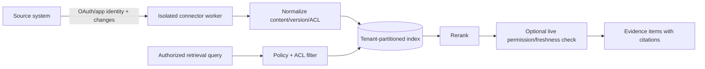

# ForgeMind Knowledge Connector Architecture

Status: Draft for architecture review  
Last updated: 2026-08-23

## Purpose

Connectors make authorized organizational knowledge retrievable without turning ForgeMind into an unrestricted copy of source systems. Google Docs, Confluence, Jira, Slack, Microsoft Teams, and GitHub remain authoritative for content, identity, permissions, versions, and deletion.

All connectors are optional. ForgeMind's local repository, skills, session, and memory functions operate without them.

## Connector boundary

ForgeMind may use a native API adapter or an MCP server. MCP registration is not proof of configuration, reachability, health, trust, or authorization. Native adapters remain necessary when MCP does not expose change feeds, content versions, ACLs, or deletion semantics.

## Common connector contract

Each connector declares:

- connector/provider/version and source account/tenant identity;
- supported resources and read/write actions;
- authentication and delegated/application authorization modes;
- minimum scopes and incremental authorization behavior;
- stable IDs, content versions, canonical URIs, authorship/time fields;
- full/backfill and incremental change mechanisms;
- ACL/visibility model and live permission-check capability;
- rate limits, pagination, retries, idempotency, and freshness SLA;
- tombstone, revocation, uninstall, and deletion behavior;
- normalization/chunking rules and data classifications;
- health, lag, coverage, and degraded-mode signals.

Connectors are read-only by default. A future write action is a separate capability with its own approval, tool receipt, and source-specific authorization.

## Ingestion and indexing

1. An administrator or user installs a connector for a bounded source/account and approves the minimum scopes.
2. Credentials are stored in a secret broker; workers receive short-lived use grants, not raw secrets in task packets.
3. The connector discovers permitted containers and records source IDs and permission metadata.
4. A backfill fetches content and versions through rate-limited, resumable jobs.
5. Normalization preserves source structure, links, authorship when allowed, timestamps, and source-specific fields.
6. Chunking follows semantic boundaries such as headings, issue fields, thread roots, code symbols, and review comments.
7. Derived lexical/vector entries carry tenant, connector, source, resource, version, ACL reference, sensitivity, and content hash.
8. Webhooks/change feeds update content, ACLs, and tombstones idempotently. Periodic reconciliation catches missed events.

The index stores only data needed for retrieval. Attachments and full content may remain source-resident and be fetched live. Secret/DLP checks occur before embeddings are created.

## Permission model

Permissions travel with content but the indexed ACL is not permanently authoritative:

- Use source-native immutable principal/group IDs, not display names.
- Preserve container, item, channel, repository, and field-level visibility when available.
- Apply tenant, principal, purpose, source scope, sensitivity, and ACL filters before search.
- Include authorization state in caches and never globally cache a user-specific catalog.
- Revalidate live for sensitive or consequential retrieval and when ACL freshness is uncertain.
- Revocation, uninstall, item deletion, or lost access immediately suppresses results and schedules derivative deletion.
- ForgeMind roles can further restrict source access but never broaden it.

Service/application indexing credentials do not imply that every user can retrieve everything indexed. Query-time principal authorization remains mandatory.

## Retrieval

The Knowledge Router decomposes the task into source-aware queries, selects connectors by relevance and authorization, runs indexed and/or live search, normalizes candidates to `EvidenceItem`, filters permissions, reranks, and returns cited excerpts with freshness and coverage.

Hybrid retrieval modes:

- **Indexed:** fast semantic/lexical search for stable corpora.
- **Live:** source search/fetch when content is highly sensitive, rapidly changing, or not retained.
- **Hybrid:** indexed discovery followed by live content/permission/version verification.

If a connector is unavailable or its index is stale, the packet states that the source was not exhaustively searched.

## Source designs

### Google Docs and Drive

**Index:** discover user/admin-selected Drive files or shared drives; use stable file IDs, revisions/modified time, export structured document content, and consume Drive changes. Preserve file and shared-drive permissions.

**Retrieval:** indexed headings/paragraphs with live file/version/permission verification for sensitive results. Prefer per-file user selection for local/team setups.

**Permissions:** request the narrowest OAuth scope. Google's current guidance recommends narrow scopes such as `drive.file`; broader read scopes are restricted and may require verification/security assessment when server-stored. See [Google Drive scope guidance](https://developers.google.com/workspace/drive/api/guides/api-specific-auth).

**Boundary:** Google credentials never enter agent context. Domain-wide delegation, if ever supported, is an enterprise-only configuration with administrator policy and per-user retrieval enforcement.

### Confluence

**Index:** spaces/pages selected by installation policy; preserve cloud/site, space, page ID, version, hierarchy, labels, restrictions, and tombstones. Use incremental events where available plus periodic version reconciliation.

**Retrieval:** search by CQL/native API or ForgeMind index; fetch the current page and restrictions before sensitive use.

**Permissions:** OAuth scopes set maximum app authority while Confluence content permissions still control actual access. See [Confluence OAuth scopes](https://developer.atlassian.com/cloud/confluence/scopes-for-oauth-2-3LO-and-forge-apps/).

**Boundary:** restricted spaces and page-level restrictions require ACL-aware chunks; removing a restriction principal invalidates cached results.

### Jira

**Index:** approved projects, issues, selected fields, comments, links, status history, and attachments under field/data policy. Preserve issue ID/key, project, version/update time, visibility/security level, and comment restrictions.

**Retrieval:** combine exact issue/error identifiers, JQL/source search, linked code/PR graph, and semantic issue/comment search.

**Permissions:** use OAuth/GitHub-style app installation scopes rather than collecting user API tokens. Dynamic webhooks can be filtered by JQL and require matching scopes; see [Jira webhooks](https://developer.atlassian.com/cloud/jira/platform/rest/v3/api-group-webhooks/).

**Boundary:** issue-security and restricted comments must never be flattened to project-only ACLs. Webhook payloads are authenticated, deduplicated, and treated as untrusted input.

### Slack

**Index:** only approved workspaces/channels and thread structures. Preserve workspace, channel, message/thread ID, edits/deletions, sender/time under privacy policy, files, and membership/visibility references.

**Retrieval:** favor exact links, channel/project filters, thread-aware chunks, recency, and live visibility checks. Direct messages and private channels are disabled by default and require explicit policy.

**Permissions:** Slack Events API delivery is tied to granted OAuth scopes and what the authorizing user or bot can see. See [Slack Events API](https://api.slack.com/apis/connections/events-api).

**Boundary:** verify Slack request signatures, deduplicate event IDs, delete edited/deleted messages from derivatives, and do not infer organization policy from informal chat without validation.

### Microsoft Teams

**Index:** approved teams/channels/chats under tenant policy using Microsoft Graph, preserving tenant/team/channel/chat/message IDs, replies, edits/deletions, membership, sensitivity/retention labels when available.

**Retrieval:** thread-aware search with live Graph authorization for protected messages. Tenant-wide message access is enterprise-only and not an MVP default.

**Permissions:** Graph supports delegated/application permissions and resource-specific consent; subscriptions require resource read permissions. See [Teams change notifications](https://learn.microsoft.com/en-us/graph/teams-changenotifications-team-and-channel).

**Boundary:** application-wide permissions have high blast radius and require admin approval, purpose limitation, tenant partitioning, encryption, audit, and DLP. Respect Microsoft retention/eDiscovery constraints rather than independently extending content life.

### GitHub

**Index:** repositories selected by a GitHub App installation; code metadata, commits, branches/tags, issues, pull requests, reviews, checks, releases, ownership, and security-safe repository metadata. Source code itself is primarily handled by the workspace/code index.

**Retrieval:** exact repository/commit/issue/PR references, graph links from issues to changes/tests, and live API verification for current status/permissions.

**Permissions:** GitHub App permissions determine accessible endpoints and can be scoped to selected repositories. See [GitHub App permission reference](https://docs.github.com/en/rest/authentication/permissions-required-for-github-apps).

**Boundary:** prefer installation tokens over personal access tokens, separate metadata/read from contents/write, never index secrets or restricted security advisories without explicit policy, and treat fork visibility independently.

## Security boundaries

- One connector installation and worker identity per organization/source account; high-risk sources may use dedicated workers.
- Network egress allowlists restrict workers to expected provider endpoints.
- Webhooks require signature/token verification, replay prevention, size limits, schema validation, and queue isolation.
- Connector content, metadata, MCP instructions, and tool outputs are untrusted data and cannot override policy/skills.
- OAuth access/refresh tokens are encrypted in a secret manager, audience-bound, rotated, and redacted from logs.
- Index partitions, encryption keys, cache keys, and observability labels include tenant identity.
- DLP and data residency policies apply before external model/embedding calls.
- Export and deletion include all derived chunks, embeddings, summaries, graph edges, and caches.

## Operations

Connector health exposes auth state, last successful backfill/change, webhook lag, rate-limit state, indexed resource count, ACL reconciliation age, failures, and deletion backlog. Circuit breakers prevent failing sources from blocking the task; omissions remain visible.

## MVP and rollout

The MVP implements a read-only GitHub connector and the common connector contract. Phase 2 adds Google Docs/Drive, Confluence, and Jira, then Slack and Teams after privacy, message-retention, and ACL evaluations. Write actions are deferred.

## Open questions

- Which sources can meet query-time ACL checks at required latency?
- Should message platforms default to live retrieval rather than persistent indexing?
- Which attachment types may be retained or embedded?
- How are group membership snapshots and nested groups represented consistently?
- What data-residency options are required before a managed service?
