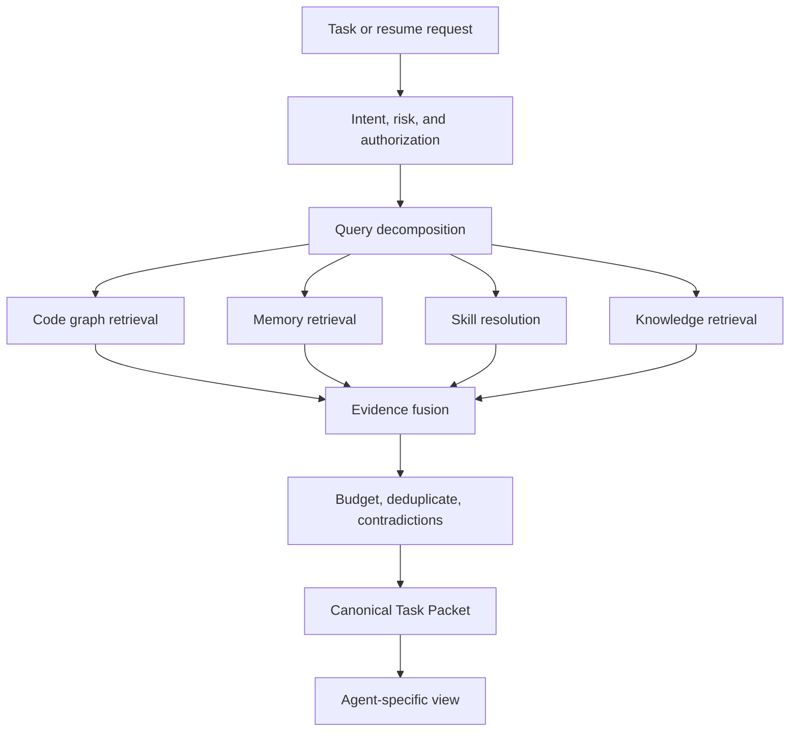

# ForgeMind Context Engine Design

Status: Draft for architecture review  
Last updated: 2026-10-07

## Implemented initial boundary

The TypeScript `ContextOptimizer`, default pass-through path, explicitly configured original store and opt-in Headroom HTTP bridge are implemented. Host authorization and network enforcement are required ports; real driver/proxy integration and task-quality benchmarks remain pending. See [implementation instructions](./context-optimization.md) and [ADR-0008](./adr/ADR-0008-optional-context-optimization.md). The retrieval and continuity system below remains the broader design.

## Objective

The Context Engine creates the smallest sufficient, permission-aware, attributable context for a task and preserves continuity when an agent, model, chat, or context window changes.

It never loads entire repositories or complete conversation histories by default. Context is an immutable, content-addressed task packet assembled from current evidence and a structured checkpoint.

## Responsibilities

- Translate task intent into retrieval plans and evidence budgets.
- Retrieve across code graph, knowledge connectors, scoped memory, and skills.
- Enforce authorization before retrieval and packing.
- Deduplicate, rerank, reconcile versions, and expose contradictions.
- Separate policy/instructions from untrusted evidence.
- Compress evidence without losing citations or mandatory constraints.
- Produce agent-specific views from one canonical packet.
- Monitor context pressure and create checkpoints before limits are reached.
- Support evidence expansion and new-chat resume.

## Retrieval and construction pipeline



The retrieval branches normally run concurrently after classification. Mandatory policy and checkpoint evidence are resolved before the packet can be finalized.

## Evidence budget

Each task has token, latency, connector-call, model-call, and cost budgets. The context budget reserves capacity in this priority order:

1. Objective, acceptance criteria, policy, safety, and stopping conditions.
2. Current checkpoint and direct user constraints.
3. Direct source/code evidence necessary for the next action.
4. Validated decisions and highly applicable memory.
5. Resolved skill instructions.
6. Supporting organizational knowledge and examples.
7. Lower-confidence or background material.

Mandatory content is never silently truncated. If it cannot fit, the engine splits the task, requests a larger approved budget, or fails visibly.

Budgets are adaptive within policy: debugging favors errors, timelines, and code neighborhoods; implementation favors interfaces, tests, standards, and impacted symbols; research favors authoritative knowledge and citations.

## Ranking and fusion

Candidates are ranked using task relevance, exact symbol/error match, graph distance, source authority, validation confidence, freshness, scope specificity, contradiction state, and context cost. Structured filters and ACLs occur before semantic ranking.

Fusion rules:

- Prefer direct source excerpts over summaries when small and critical.
- Prefer immutable/current source versions over copied recollections.
- Collapse duplicate chunks while retaining all relevant citations.
- Exclude superseded memory by default.
- Include material contradictions together; never invent a consensus.
- Label stale indexes and sources that could not be queried.
- Preserve exact identifiers, versions, commands, outcomes, and unresolved blockers during compression.

## Task packet layout

```text
TaskPacket
├── task/workspace/source-snapshot identity
├── objective and acceptance criteria
├── policy, permissions, risk, budgets, stopping conditions
├── structured session checkpoint
├── plan and assigned agent role
├── code evidence
├── organizational knowledge evidence
├── scoped memory evidence
├── resolved skill instructions and digests
├── allowed tools/capabilities
├── expected output contract
├── conflicts, staleness, and omissions
└── evidence provenance and packet hash
```

Credentials, complete conversations, unrelated source content, private reasoning, and mutable provider session objects are excluded.

## Long-session continuity

The engine tracks context pressure from packet size, accumulated native session state, tool results, task duration, decision density, and model/runtime signals. It checkpoints at safe boundaries—for example after a decision, completed experiment, test phase, or before an agent handoff—rather than waiting for a hard context failure.

### Five-hour development example

After five hours the native chat approaches its context limit. ForgeMind creates:

```text
SessionCheckpoint
├── objective
├── acceptance criteria and constraints
├── files/symbols/documents inspected with versions
├── changes/artifacts produced with source snapshot
├── decisions and rationale/evidence
├── failed approaches and observed outcomes
├── current hypotheses with supporting/counter evidence
├── tests/commands/actions and receipts
├── blockers and unresolved questions
├── next recommended steps
├── granted capabilities and approvals still valid
└── parent packet/checkpoint lineage and content hash
```

The checkpoint deliberately excludes conversational filler, repeated tool output, discarded prose, chain-of-thought, credentials, and unverified claims that are not needed to continue.

## New-chat resume flow

1. Authenticate the user and authorize the checkpoint, workspace, and sources.
2. Load the checkpoint and verify its content hash and lineage.
3. Reconcile the recorded source snapshot with the current repository and connector versions.
4. Mark changed, missing, revoked, or stale evidence.
5. Re-run targeted retrieval for the next steps and unresolved hypotheses.
6. Re-resolve skills and policy; do not assume old grants remain valid.
7. Build a new packet referencing the checkpoint, with a concise “what changed” section.
8. Send an agent-specific view through the selected Agent Driver.

Provider-native session resume may be used as an optimization, but the ForgeMind checkpoint is the portable authority and can resume in a different agent.

## Checkpoint correctness

Checkpoints are schema-validated, immutable after creation, content-addressed, and linked as a directed lineage. A correction creates a child checkpoint. Source references use repository commit or immutable dirty-workspace snapshot identity plus file hashes where required.

The user can inspect and correct checkpoint facts. A checkpoint may contain hypotheses, but each is explicitly labeled and cannot become project memory without the learning workflow.

## Context safety

- Packet sections establish trust ordering: policy and user constraints outrank skills; skills outrank retrieved data; retrieved instruction-like text remains quoted evidence.
- Source content is scanned/labeled for secrets, personal data, and prompt injection before packing.
- Evidence visibility is rechecked for the target agent/principal.
- Agent-specific views cannot add authority or evidence absent from the canonical packet.
- Tool outputs are size-limited, normalized, and stored by reference when large.
- A task packet records omissions so absence is not mistaken for an exhaustive search.

## Caching

Cache keys include tenant, principal/ACL set, purpose, policy version, source versions, retrieval query, skill locks, and packet schema. Revocation/deletion invalidates affected caches immediately. Cross-principal caching is prohibited unless the evidence and policy are demonstrably identical and public within the tenant.

## Evaluation

- Continuation success without material user restatement.
- Context tokens and latency versus full-history/full-file baseline.
- Retrieval precision/recall on labeled tasks.
- Mandatory-constraint preservation after compression.
- Evidence citation correctness and source freshness.
- Unauthorized evidence count (target zero).
- Contradiction detection and stale-source disclosure.
- Cross-agent resume compatibility.

## Open questions

- Which context-pressure signals are portable across Agent Drivers?
- Should users be able to pin evidence that bypasses normal ranking but not policy?
- What packet size classes should adapters negotiate?
- When should compression use deterministic extraction versus a model summary?
