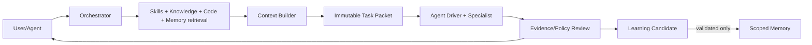

# ForgeMind Architecture Handoff

Status: Foundational design package  
Last updated: 2026-10-07

## Current vision

ForgeMind is an open-source, repository-independent AI Engineering Intelligence Platform. It is the shared control and intelligence plane between engineers, coding agents, repositories, organizational knowledge, skills, and validated memory.

ForgeMind does not replace Codex, Claude Code, Cursor, or future coding agents. It gives them portable task packets, relevant evidence, scoped capabilities, durable checkpoints, reusable skills, and conservative learning. A team should be able to change agents without losing its accumulated engineering knowledge.

## Current state

This repository contains the architecture package plus TypeScript local identity/policy, context optimization, Codex and Cursor protocol adapters, and real offline host slices. The macOS host enforces durable launch authorization and native sandbox/lifecycle restrictions. Both deterministic driver fixtures and native Codex initialize-only startup pass inside this host; native Cursor execution, provider/spend/write enforcement and the broader application remain pending.

## Architectural decisions

1. **Agent independence:** canonical domain contracts and an Agent Driver boundary; ACP, native SDK/App Server, agent-as-MCP, and CLI are adapters.
2. **Scoped memory:** global, organization, project, and session scopes with structured records; no permanent full conversations.
3. **Skills as capability packages:** portable open package shape plus immutable versions, trust, tests, locks, and registry governance.
4. **Selective context:** intent-driven code, memory, skill, and knowledge retrieval into a bounded, cited task packet.
5. **MCP at the edge:** ForgeMind is an MCP server for agents and an MCP host/client for optional connectors; MCP is not the internal workflow or memory model.
6. **Policy outside models:** models propose; deterministic policy authorizes.
7. **Learning is quarantined:** results produce observations and candidates; validation and authorized promotion create memory.
8. **Source permissions persist:** indexes preserve ACLs and retrieval revalidates protected content.
9. **Local-first modularity:** begin with a modular monolith behind bounded interfaces; distribute only after measurement.
10. **Source-bound evidence:** packets, results, tests, checkpoints, and receipts bind to exact source/content versions.
11. **Local storage and staged retrieval:** SQLite owns authoritative application records; local files hold large artifacts by digest. Start with structured queries and FTS5, then add hybrid semantic retrieval later in the MVP behind a replaceable interface. Ruflo development coordination remains separate. See [ADR-0006](./adr/ADR-0006-local-storage-and-staged-semantic-search.md).
12. **Initial Agent Drivers:** Codex is the first real driver; Cursor is the next compatibility target after the deterministic fake-driver baseline. App Server stdio for Codex and ACP stdio for Cursor are recommended surfaces pending runtime conformance. See [MVP driver selection](./agents.md#mvp-driver-selection).
13. **Local identity/policy slice:** trusted POSIX owner, invocation-bound grants, exact capabilities, child attenuation, SQLite receipts and deterministic fake action dispatch are implemented. A separate privileged API now durably reserves real external host envelopes. See [ADR-0007](./adr/ADR-0007-local-identity-and-policy.md) and [run instructions](./local-policy.md).
14. **Optional context optimization:** pass-through is the implemented default; Headroom is an opt-in compression-only HTTP bridge requiring trusted host authorization/execution ports. No real proxy/model integration is activated. Build the raw Codex baseline first, then evaluate compression. Graphify remains deferred to code intelligence. See [ADR-0008](./adr/ADR-0008-optional-context-optimization.md) and [run instructions](./context-optimization.md).
15. **Real offline execution host:** default-deny macOS Seatbelt, selected-file snapshots, sealed command manifests, credential isolation, independent watchdog, revocation/fencing checks and source-bound terminal receipts are implemented. The legacy direct live-task launcher is disabled. See [ADR-0010](./adr/ADR-0010-offline-host-enforcement.md) and [host instructions](./host-enforcement.md).
16. **Cursor ACP slice:** explicit model/mode configuration, canonical text packets, strict JSON-RPC and conservative lifecycle handling are implemented with deterministic and real offline host fixtures. Cursor persistence is confined to private scratch; native login, prompts, model routing and billing remain unverified. See [ADR-0011](./adr/ADR-0011-cursor-acp-protocol-slice.md).
17. **Windows verification path:** native PowerShell clone/build/portable fixture commands, a read-only doctor and shell-independent test discovery are implemented. Fixtures use canonical workspace paths. A native Windows run remains to be captured; Windows SID/ACL policy and an enforced host are still unimplemented. See [Windows instructions](./windows.md).
18. **Project planning preferences:** onboarding stores project/document identity and non-secret draft PR, evidence and plan review choices; new projects can scaffold missing draft PRD/SRS/ADR templates. Source/settings-bound preflight supports owner review and before-video receipts. The supplied-plan CLI is offline; local project memory now feeds cited context into its plan digest. Wider memory scopes, automatic planning and live task/completion integration remain pending. See [ADR-0012](./adr/ADR-0012-project-onboarding-and-plan-preflight.md).
19. **Durable project memory:** local-owner SQLite persistence bound to project/workspace, registered document candidates, exact-digest validation, FTS5 retrieval, lifecycle/redaction and cited plan context are implemented. See [ADR-0013](./adr/ADR-0013-durable-project-memory.md) and [setup](./project-memory.md). Semantic retrieval and broader memory scopes remain pending.

## Canonical flow

The initial [Codex protocol slice](./codex-driver.md) and [Cursor ACP slice](./cursor-driver.md) share the enforced offline host. Native provider execution, checkpoint interoperability and Headroom evaluation remain subsequent gates.



## Recommended repository structure

The structure below is a recommendation for implementation planning, not code created by this architecture task.

```text
forgemind/
├── docs/
│   ├── adr/
│   └── *.md
├── packages/
│   ├── contracts/            protocol-neutral schemas and compatibility fixtures
│   ├── orchestration/        task state machine, planning, policy integration
│   ├── context-engine/       retrieval fusion, budgets, task packets, checkpoints
│   ├── code-intelligence/    analyzer SPI, graph schema, indexing and retrieval
│   ├── memory/               scoped records, lifecycle, retrieval, deletion
│   ├── skills/               registry, resolver, loader, evaluations
│   ├── learning/             observations, candidates, validation, promotion
│   ├── connectors-core/      connector contracts and shared ingestion runtime
│   ├── mcp-edge/             inbound server and outbound host/client compatibility
│   ├── agent-drivers/        ACP/native SDK/App Server/CLI adapters
│   ├── policy/               authorization and capability decision interface
│   ├── audit/                receipts, traces, metrics, redaction
│   └── local-runtime/        local modular-monolith composition
├── connectors/
│   ├── github/
│   ├── google-drive/
│   ├── confluence/
│   ├── jira/
│   ├── slack/
│   └── teams/
├── analyzers/
│   ├── typescript/
│   └── <future-language>/
├── skills/
│   └── webrtc-debugging/
├── apps/
│   ├── cli/
│   └── server/
├── tests/
│   ├── contracts/
│   ├── conformance/
│   ├── security/
│   ├── retrieval-evals/
│   └── end-to-end/
├── config/                  schemas and safe example policy only
└── scripts/                 repository development/verification scripts
```

Bounded contexts should not import another context's persistence implementation. Shared manifests/lockfiles have one integration owner during concurrent work.

## Complete documentation tree

```text
docs/
├── PRD.md
├── architecture.md
├── agents.md
├── skills.md
├── memory.md
├── context-engine.md
├── connectors.md
├── learning.md
├── security.md
├── roadmap.md
├── handoff.md
└── adr/
    ├── ADR-0001-agent-independent-architecture.md
    ├── ADR-0002-memory-architecture.md
    ├── ADR-0003-skill-system-architecture.md
    ├── ADR-0004-context-retrieval-strategy.md
    ├── ADR-0005-mcp-integration-strategy.md
    ├── ADR-0006-local-storage-and-staged-semantic-search.md
    ├── ADR-0007-local-identity-and-policy.md
    └── ADR-0008-optional-context-optimization.md
```

## MVP recommendation

Build one local-first vertical slice rather than all services:

- protocol-neutral task/evidence/packet/checkpoint/result/memory/policy contracts;
- local service with MCP facade;
- Agent Driver conformance harness and three agent integrations;
- multiple local Git workspaces and a TypeScript-first code graph;
- project/session memory and filesystem/Git skills;
- bounded context retrieval and cross-agent checkpoint resume;
- read-only GitHub connector;
- candidate lessons with manual project validation;
- audit, path security, tenant/project isolation, and full derivative deletion.

Do not start with Slack/Teams indexing, autonomous organization learning, connector writes, a public marketplace, microservices, or every programming language.

## Major technical risks

1. ACL leakage through chunks, embeddings, graph edges, caches, and summaries.
2. Retrieval false negatives or stale evidence under strict context budgets.
3. Memory poisoning, false generalization, and knowledge drift.
4. Agent Driver capability/permission mismatches.
5. Incomplete cross-language code graphs and dirty-workspace identity.
6. Connector API/scope/webhook churn and deletion propagation.
7. Prompt injection through documents, code comments, skills, MCP servers, and tool outputs.
8. Premature operational complexity from too many storage/services.
9. Weak evaluation baselines that cannot support product claims.

Controls and validation expectations are detailed in [architecture.md](./architecture.md) and [security.md](./security.md).

## Open questions requiring decisions

### Before implementation

- Ratify or amend ADR-0001 through ADR-0005.
- Choose the second MVP language after TypeScript, or defer it.
- Define typed storage replacement interfaces and migration contracts for the accepted SQLite/local-file baseline in ADR-0006. Choose the embedding provider and vector implementation before the semantic retrieval milestone.
- Validate the chosen Codex-first/Cursor-next integration surfaces and capability gaps; decide remaining driver order. Codex App Server is experimental and Cursor compatibility is not yet certified.
- Decide whether read-only GitHub is a required MVP dependency or an optional demonstrator.
- Approve task packet/checkpoint schema ownership and versioning policy.
- Integrate the implemented ADR-0007 local identity/policy boundary with real drivers and verify sandbox enforcement.
- Define raw session, checkpoint, candidate, audit, backup, and deletion retention defaults.
- Decide which actions always require interactive approval.

### Before team/cloud deployment

- Identity provider, group mapping, policy engine, and tenant-key model.
- Indexed versus live retrieval policy for chat/document systems.
- External model/embedding provider and data-residency rules.
- Organization memory validator roles and promotion quorum.
- Public/private skill registry governance, signing, licensing, and revocation.
- Availability, recovery, deletion, and audit service objectives.

## Next recommended actions

1. Hold an architecture review and record ADR feedback rather than coding around unresolved choices.
2. Convert canonical contracts into language-neutral schemas and golden examples.
3. Create source-bound evaluation datasets for context reduction, retrieval, continuation, ACL isolation, and deletion.
4. Create threat models for the first Agent Driver, TypeScript analyzer, GitHub connector, and skill loader.
5. Prototype a deterministic end-to-end vertical slice with fake agent/connector adapters.
6. Add real adapters one at a time behind conformance tests.
7. Benchmark the candidate against full-history/full-file and agent-native baselines before optimizing.

## Handoff acceptance checklist

- Read the PRD and all accepted ADRs first.
- Preserve canonical contract and bounded-context ownership.
- Keep MCP protocol version differences inside the edge adapter.
- Do not store full conversations as durable memory.
- Never let agents, skills, MCP metadata, or learned content grant authority.
- Bind claims and tests to exact source/packet identities.
- Add an ADR before reversing a foundational decision.
- Do not commit, publish, or release without separately authorized repository workflow.
