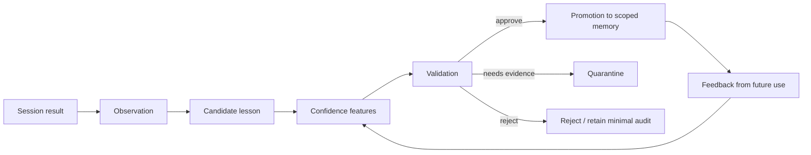

# ForgeMind Learning System Design

Status: Draft for architecture review  
Last updated: 2026-08-23

## Objective

ForgeMind learns reusable engineering knowledge from completed tasks without allowing one interaction, hallucination, or accidental success to create a permanent rule.

Learning produces proposed structured knowledge. It never grants authority, changes security policy, or publishes a skill by itself.

## Pipeline

## Inputs

- Original task packet and source snapshot.
- Agent results and normalized events.
- Tool/action receipts and generated artifacts.
- Executed test, review, benchmark, or production evidence.
- Human feedback and correction.
- Prior supporting, contradicting, or superseded memory.

Agent prose alone is a claim, not outcome evidence.

## Observation

An observation is an immutable, task-scoped statement about what was seen: a test failed, a change passed, an approach produced an error, a reviewer rejected a claim, or a source document stated a policy. It includes exact evidence references, time, environment, source version, producer, and derivation.

Observations remain session/project audit material under short retention unless selected for a candidate. Sensitive values are redacted before extraction.

## Candidate lesson

A candidate is a normalized proposal such as:

- “In project X at dependency version Y, symptom S was caused by C and fixed by F.”
- “Approach A is unsafe under condition B.”
- “Tests T1 and T2 are necessary when changing interface I.”
- “Workflow W repeatedly reduces diagnosis time for class D.”

It declares proposed type, scope, applicability, exclusions, evidence, counterevidence, novelty, temporal bounds, and validation plan. Candidates start quarantined and are not retrieved as trusted guidance. They may be visible to validators as explicitly untrusted.

## Confidence features

ForgeMind stores separate features rather than one opaque model confidence:

| Feature | Examples |
| --- | --- |
| Source authority | Executed test, code at revision, approved ADR, issue comment, agent inference |
| Outcome strength | Reproduced failure, causal experiment, regression test, correlation only |
| Independence | Same run repeated versus different tasks/environments/agents |
| Review | None, project owner, domain expert, policy authority |
| Recurrence | Single occurrence, repeated in project, repeated across projects |
| Applicability | Exact version/environment boundaries and known exclusions |
| Freshness | Time since verification and dependency/source changes |
| Contradictions | Count, authority, resolution state |
| Security/privacy | Sensitivity, secret/PII scan, permission compatibility |

A policy maps these features to validation requirements. A model may help extract or compare evidence but cannot self-score into promotion.

## Validation methods

- Deterministic schema, source, and provenance checks.
- Reproduction against the exact source/environment.
- Regression or negative test demonstrating the boundary.
- Independent task replay or agent review.
- Project/domain-owner approval.
- Comparison with authoritative documentation or existing decisions.
- Security/privacy/license review for broader scopes or skills.
- Time-delayed recurrence before generalization.

Validators must be authorized for the proposed scope and must not rely solely on the producing agent. Unavailable evidence results in quarantine or rejection, not optimistic promotion.

## Promotion policy

### Project memory

May accept a single task only when evidence is authoritative and deterministic—for example, an approved ADR or reproducible regression test—and a project validator approves. Otherwise require recurrence.

### Organization memory

Requires independent evidence across relevant projects or an authoritative organization source, explicit generalization boundaries, organization review, and security/privacy clearance.

### Global memory

Requires source-independent applicability, licensing/provenance clearance, public evidence, maintainer review, and no confidential derivation.

### Skill candidate

Procedural patterns become a quarantined skill draft, then pass trigger, negative, workflow, safety, regression, and cross-agent compatibility tests. Memory promotion is not skill publication.

## Preventing one-shot rules

The following safeguards are mandatory:

- Default all extracted lessons to candidate/quarantine.
- Never infer organization/global scope from one session.
- Require evidence diversity or an authoritative source.
- Search for counterexamples and existing contradictions.
- Preserve version/environment boundaries.
- Use expiry/revalidation for dependency- or time-sensitive claims.
- Keep policy and security rules in authoritative configuration, not learned memory.
- Require human approval for organization/global promotion in the initial releases.

## Feedback and unlearning

Future retrieval records whether a lesson was used, ignored, corrected, contradicted, or associated with a regression. These signals can trigger revalidation but do not automatically rewrite memory. Corrections create superseding records. Revoked or deleted source evidence may lower confidence, quarantine the record, or trigger deletion through the derivative manifest.

## Learning from failures

Failure is useful only when the condition and evidence are clear. Store the failed approach, environment, observed result, and applicability—not “never do X” unless validation proves the general rule. A failed agent interaction caused by missing context or permissions should improve retrieval/routing evaluation rather than become domain knowledge.

## Privacy and security

- DLP/secret/PII scanning precedes candidate storage and embedding.
- Candidate stores are isolated from trusted memory.
- Retrieved content and MCP outputs cannot become instructions without validation.
- Validators see only evidence they are authorized to access.
- Promotion cannot broaden the audience beyond source licensing and data permissions.
- All extraction, validation, promotion, correction, revocation, and deletion events are audited.

## Metrics

- Candidate acceptance/rejection/quarantine rates by type and scope.
- Evidence diversity and time-to-validation.
- Reuse success and later correction/regression rate.
- False generalization and contradiction rate.
- Number of unauthorized or sensitive promotions (target zero).
- Context/task efficiency attributable to validated lessons.
- Skill candidates that pass full evaluation versus generated noise.

## Open questions

- Which deterministic evidence allows automatic project-level promotion?
- How many independent observations constitute recurrence for each lesson type?
- How should negative outcomes update confidence without creating self-reinforcing bias?
- Should validators use quorum, named ownership, or policy-as-code per organization?
