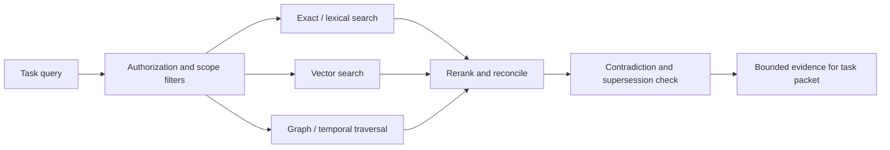

# ForgeMind Memory Architecture

Status: Draft for architecture review  
Last updated: 2026-08-23

## Purpose and invariant

Implementation status: local-owner durable project memory, registered-document ingestion, FTS5/exact retrieval, lifecycle controls and supplied-plan context integration are implemented; see [project memory](./project-memory.md). Session/organization memory, semantic retrieval and broader architecture controls below remain pending. Policy persistence, ephemeral original evidence and Ruflo development memory are separate. [Project onboarding](./project-workflow.md) now persists non-secret per-project preferences and registers PRD/SRS/ADR sources, without turning them into validated memory or permissions.

ForgeMind memory preserves durable engineering knowledge and task continuity across agents without turning complete conversations into a permanent surveillance or prompt-injection corpus.

Permanent memory contains structured lessons, decisions, mistakes, patterns, and fixes. Raw dialogue may be held temporarily for the active session under retention policy, but it is not promoted as memory.

## Independent dimensions

Memory scope, type, and representation are separate:

- **Scope:** global, organization, project, session.
- **Type:** fact, decision, lesson, mistake, pattern, fix, hypothesis, checkpoint, or skill candidate.
- **Representation:** structured record, exact-key state, searchable text, vector projection, or temporal graph relation.

This prevents “organization memory” from meaning a database technology or “episodic memory” from implying permanent transcripts.

## Memory scopes

| Scope | Contents | Default writers | Retrieval boundary | Typical retention |
| --- | --- | --- | --- | --- |
| Global | Source-independent reusable engineering knowledge | Maintainer-governed import/promotion | Installation/public policy | Until superseded, revoked, or deleted |
| Organization | Company standards, workflows, tools, ownership, validated cross-project lessons | Authorized organization validators | Principal + organization ACL/purpose | Policy-defined; periodic review |
| Project | Repository/service decisions, fixes, mistakes, patterns, version-specific knowledge | Project validators and approved pipelines | Principal + organization + project | Project lifecycle and applicability |
| Session | Objective, evidence state, decisions, failures, hypotheses, next steps | Active orchestration session | Task participants only | Short TTL after closure, then minimize/delete |

Broader scope means broader consequences and therefore requires stronger evidence and authority.

## Structured memory record

Every durable record contains:

- stable ID, tenant, scope, owner, organization/project/session references;
- type, subject, structured statement, applicability conditions, and exclusions;
- source references with connector/repository ID, immutable version/hash, URI, author when allowed, source time, and ingestion time;
- derivation metadata: originating task/packet/result, extraction workflow/model version, and validators;
- lifecycle: candidate, validated, promoted, superseded, revoked, quarantined, or deleted;
- temporal validity: learned, valid-from/to, last verified, expiry, and supersession links;
- relations such as supports, contradicts, supersedes, derived-from, caused-by, and applies-to;
- sensitivity, ACL/policy reference, retention class, legal-hold marker, and deletion manifest;
- confidence features and validation evidence rather than one opaque score.

Useful provenance semantics may align with [W3C PROV-O](https://www.w3.org/TR/prov-o/) entities, activities, agents, derivation, and attribution.

## Storage approach

The logical memory service owns authoritative structured records in a transactional store. Derived projections serve different retrieval needs:

- relational/document fields for scope, ACL, lifecycle, versions, and exact filters;
- full-text index for symbols, error strings, versions, and exact decisions;
- vector index for fuzzy semantic matching;
- temporal graph for entities, dependencies, causality claims, contradictions, and supersession;
- object storage only for approved evidence artifacts too large for records.

Local mode may implement these behind one embedded engine; cloud mode may split them. Technology is replaceable. Derived projections are rebuildable and tracked in a derivative manifest so updates and deletions propagate.

Encryption keys and physical/logical partitions follow tenant boundaries. Session and candidate stores are separated from trusted organization/global read stores. Normal agents receive read-only shared memory.

## Retrieval approach

1. Resolve principal, tenant, organization, projects, purpose, task intent, and policy version.
2. Apply tenant, scope, ACL, sensitivity, lifecycle, validity, and retention filters before search. Similarity is never authorization.
3. Run exact/lexical, semantic, and graph retrieval as appropriate.
4. Rerank by relevance, source authority, independent support, validation quality, scope specificity, recency, and context cost.
5. Remove duplicates and superseded records; preserve unresolved contradictions.
6. Return records with evidence citations, confidence features, retrieval reasons, and staleness.

For consequential actions, permission and source validity are rechecked live when possible. Retrieval logs store identifiers and decisions, not unnecessary protected content.

## Confidence model

Confidence is an inspectable feature set:

- source authority and source type;
- number and independence of supporting observations;
- executable test or operational outcome;
- human/policy validation authority;
- recency and version applicability;
- counterevidence and unresolved contradictions;
- scope specificity;
- later retrieval usefulness and regressions.

A model-generated confidence number alone cannot authorize promotion.

## Promotion rules

The lifecycle is:

`observation → candidate → validated → promoted → superseded/revoked/deleted`

### Session to project

Requires a successful or clearly diagnosed outcome, source-bound evidence, no unresolved high-confidence contradiction, and project-authorized review or an approved deterministic validation. The promoted record is a minimized derivative, not the transcript.

### Project to organization

Requires cross-project applicability, repeated independent success or authoritative organization documentation, security/privacy review, an organization validator, and explicit exclusions. Version-specific workarounds should remain project-scoped.

### Organization to global

Requires source independence, license/provenance clearance, maintainer governance, security review, public applicability, and evidence beyond a single organization. Company-confidential content can never be promoted globally.

### Lesson to skill candidate

Repeated procedural lessons may generate a quarantined draft skill. Publication requires trigger, negative, safety, regression, and compatibility tests plus skill-registry review.

One failed or successful interaction never creates a permanent organization/global rule.

## Correction, contradiction, and supersession

Memory is not silently overwritten. Corrections create a new record linked by `supersedes`; the old record becomes non-retrievable by default but remains auditable according to retention. Contradictory active records are returned together with their sources until an authorized validation resolves them. Time- or version-bounded statements expire or require revalidation when dependencies or repository revisions change.

## Deletion rules

Deletion can be triggered by a user/owner request, connector revocation, source deletion or loss of access, retention expiry, project removal, legal/privacy policy, secret detection, or administrator action.

The deletion workflow:

1. Authorize and record the request.
2. Immediately suppress retrieval and invalidate caches.
3. Tombstone the authoritative record.
4. Delete or redact text, vectors, graph edges, summaries, packet caches, and exported derivatives using the derivative manifest.
5. Propagate to backups within the documented retention window.
6. Retain only content-free audit/tombstone metadata when legally allowed.
7. Emit a verifiable completion receipt.

Immutability does not override privacy, contract, or legal deletion obligations. Legal holds prevent deletion only under explicit policy and authority.

## Session minimization

During an active task, ephemeral event history may support checkpoint generation and debugging. At checkpoint time ForgeMind extracts objective, inspected artifacts, decisions, failed approaches, hypotheses, next steps, and exact source identities. After closure and the short retention window, raw dialogue/tool chatter is deleted; validated derivatives and audit metadata remain according to their separate policies.

## Threats and controls

- **Memory poisoning:** candidate quarantine, read-only trusted stores, provenance, contradiction checks, and validator gates.
- **Cross-tenant leakage:** partitioned indexes, pre-search authorization filters, tenant-bound keys, and adversarial tests.
- **Embedding inversion or inference:** minimize sensitive content, encrypt/partition vectors, and restrict index access.
- **Stale policy:** separate policy from learned memory; policy records come only from authoritative configuration.
- **Secret persistence:** DLP/secret scanning before storage and embedding, immediate revocation/deletion path.
- **Prompt injection:** memory is quoted data at lower trust than system policy and verified skill instructions.

## Operations and observability

Metrics include retrieval precision/recall, unauthorized-result count, stale/superseded retrieval, promotion/rejection rate, validation latency, memory reuse success, deletion SLA, and index drift. Audit events cover reads, writes, corrections, promotions, revocations, exports, and deletion without capturing chain-of-thought.

## Research basis

ForgeMind reuses thread/long-term separation and semantic/episodic/procedural distinctions from [LangGraph memory](https://docs.langchain.com/oss/python/concepts/memory), bounded active-context ideas from [MemGPT](https://arxiv.org/abs/2310.08560), modular memory concepts from [CoALA](https://arxiv.org/abs/2309.02427), and temporal graph ideas from [Zep/Graphiti](https://arxiv.org/abs/2501.13956). It adds tenant/ACL enforcement, structured provenance, promotion governance, and deletion across derived representations.

## Open questions

- Which storage engine combination best supports local mode without constraining cloud scale?
- What default TTLs apply to raw session events, checkpoints, and rejected candidates?
- Which validation evidence is sufficient for deterministic project promotion?
- Can private local memory sync across devices without creating a new organization scope?
