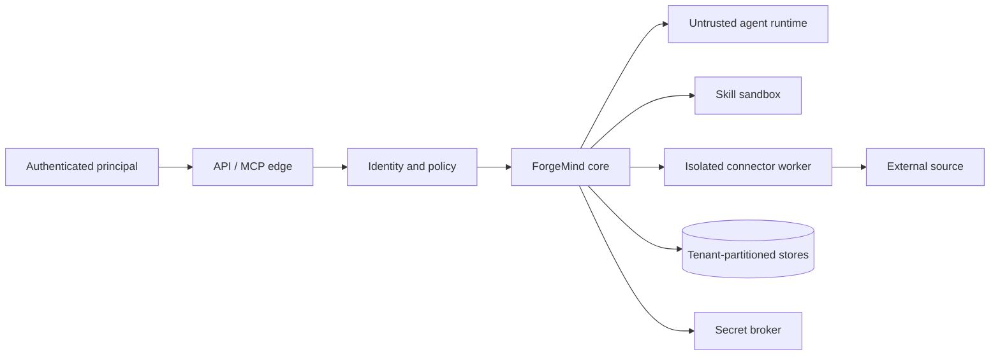

# ForgeMind Security Considerations

Status: Initial security architecture  
Last updated: 2026-10-07

## Security objective

ForgeMind processes source code, company documents, agent instructions, tool capabilities, and persistent memory. Its primary security obligation is to prevent an agent, connector, skill, user, or retrieved document from gaining authority or visibility beyond the authenticated principal and explicit task.

Security decisions are enforced by deterministic policy and source systems. Model output, learned memory, MCP annotations, and skill metadata are evidence or claims—not authority.

## Assets

- Private source code, commit history, diffs, ownership, and build artifacts.
- Company documents, tickets, chat messages, attachments, and metadata.
- Credentials, OAuth tokens, signing keys, model/provider keys, and short-lived grants.
- Global, organization, project, and session memory.
- Skills, scripts, dependencies, signatures, evaluations, and registries.
- Task packets, checkpoints, agent results, tool receipts, and audit events.
- Tenant configuration, identity mappings, policies, and encryption keys.

## Trust boundaries

Agents, source content, connector/MCP servers, skill packages, model providers, webhooks, and tool outputs are untrusted boundaries even when authenticated. Local mode reduces network exposure but does not make repository skills or subprocesses trusted.

## Identity and authorization

The executable local-mode baseline is defined in [ADR-0007](./adr/ADR-0007-local-identity-and-policy.md) and [local policy usage](./local-policy.md). It implements a trusted POSIX owner, invocation-bound grants, SQLite receipts and deterministic fake dispatch. Real driver sandbox enforcement remains a separate conformance gate.

- Authenticate humans and service identities; map stable provider IDs to ForgeMind principals.
- Derive an `AuthorizationContext` for every request with tenant, organization, projects, roles, source grants, purpose, policy version, allowed capabilities, and expiry.
- Use deny-by-default RBAC plus resource/attribute/purpose checks. Organization roles cannot override source-system ACLs.
- Evaluate authorization at intake, retrieval, capability grant, external action, memory promotion, export, and deletion.
- Child agents can receive a strict subset of parent capabilities and a shorter lifetime, never more authority or delegation depth.
- Consequential actions emit a `PolicyDecision` receipt bound to principal, task, resource, source state, rule version, and result.
- Human approval is required where policy specifies; a model cannot simulate approval.

## Source code access

- Register repositories by logical identity and approved roots; canonicalize and validate absolute paths at adapter boundaries.
- Prevent `..`, symlink, mount, archive, and case-normalization escapes.
- Read only the source snapshot authorized for the task; content-address dirty worktrees without copying them to unrelated storage.
- Enforce path-level read/write claims and a single writer per worktree.
- Run code analysis and tests in isolated processes/containers with minimal environment and network.
- Do not send code to external models/embedders unless tenant policy permits the provider, region, retention mode, and data class.
- Treat generated code and repository instructions as untrusted until reviewed.

## Company documents and connector data

- Request least-privilege OAuth scopes and prefer delegated/per-resource consent where possible.
- Preserve source IDs, versions, ACLs, tenant, sensitivity, and deletion state on every derived chunk.
- Filter authorization before search and revalidate live for sensitive or consequential use.
- Do not infer user access from an indexing service account.
- Support source deletion, loss-of-access, connector uninstall, retention labels, and legal holds.
- Default Slack/Teams private messages and tenant-wide message indexing to disabled.
- Prevent informal documents or chat from masquerading as authoritative policy through source/trust labels.

## Secrets

- Credentials live only in a secret broker or local OS credential facility; never in repositories, skill packages, task packets, checkpoints, memory, embeddings, prompts, or logs.
- Agents receive narrow expiring capability handles, not reusable raw tokens.
- Use separate audience-bound credentials for ForgeMind, every connector, and every upstream API. Token passthrough is prohibited.
- Redact secrets at ingestion, tool output, event, memory extraction, and observability boundaries.
- Rotate/revoke credentials and invalidate active grants on compromise or connector removal.
- Block broad environment inheritance for subprocesses and stdio MCP servers.

## MCP security

For current MCP 2026-07-28:

- Remote HTTP servers use OAuth 2.1 patterns, protected-resource metadata, PKCE, resource indicators/audience validation, TLS, least privilege, and incremental authorization as applicable.
- Local HTTP servers validate `Origin`, bind to loopback by default, and authenticate requests.
- Stdio MCP installation is arbitrary process execution: show the exact command, require trust/consent, minimize environment and working directory, verify packages, and sandbox.
- Cache tool/resource catalogs by server, tenant, principal, scopes, and protocol version because authorization may change catalog visibility.
- Validate tool inputs/outputs, enforce timeouts/size limits, retain a denial path, and require confirmation for sensitive actions.
- Treat server instructions, prompts, resources, tool descriptions/annotations, and results as untrusted.

See the official [MCP authorization specification](https://modelcontextprotocol.io/specification/2026-07-28/basic/authorization) and [tools security guidance](https://modelcontextprotocol.io/specification/2026-07-28/server/tools).

## Skill supply chain

- Resolve immutable version and digest; do not execute mutable `latest`.
- Verify publisher namespace, signature/attestation, source commit, license, SBOM, dependency lock, and registry status.
- Quarantine public, project, and generated skills until required review/tests pass.
- Scan instructions, scripts, binaries, hidden content, external URLs, install hooks, credential access, network destinations, and path references.
- Sandbox deterministic helpers with deny-by-default filesystem/network access.
- Effective permissions are the intersection of host policies; skill `allowed-tools`/metadata cannot grant access.
- Support deprecation, revocation, rollback, and historical packet warnings.

## Memory isolation and integrity

- Physically or logically partition records and all search/vector/graph projections by tenant; include project/scope filters before retrieval.
- Separate candidate/writable session stores from trusted read-only organization/global stores.
- Do not permanently store complete conversations.
- DLP/secret/PII-scan content before storage or embedding.
- Require provenance, evidence, temporal validity, confidence features, and validator authority for promotion.
- Treat retrieved memory as lower-trust data and expose contradictions/supersession.
- Propagate deletion to primary records, embeddings, graph edges, summaries, caches, task packets, exports, and backups.
- Encrypt in transit and at rest; support tenant-specific/customer-managed keys for enterprise deployments.

## Multi-project and multi-tenant security

- Namespace organizations, projects, repositories, connectors, skills, tasks, caches, queues, metrics, and storage keys.
- Do not execute a cross-tenant query and filter afterward; constrain the search partition before retrieval.
- Cross-project knowledge requires explicit organization scope and compatible source ACLs.
- Service identities are tenant/project-bound and cannot enumerate other tenants.
- Backups, analytics, logs, test datasets, and support tooling preserve the same isolation.
- Test tenant isolation with adversarial identifiers, shared groups, forks, renamed resources, deletion, and cache behavior.

## Prompt injection and confused-deputy defense

Retrieved content can instruct an agent to ignore rules, call tools, reveal secrets, or persist false memory. Controls:

- Strong packet trust sections and explicit quoting of source content as data.
- Policy and capability decisions outside the model.
- Tool intents reauthorized against principal, task purpose, arguments, and resource.
- No automatic execution based solely on retrieved text or MCP annotations.
- Network/destination allowlists and output/DLP checks.
- Independent review for high-impact actions and memory promotion.
- Audit chain from source evidence through packet, agent, tool, result, and promotion.

## Data protection and privacy

- Minimize collection and define purpose/retention per data class.
- Provide inspect, correct, export, delete, and connector-disconnect controls.
- Avoid employee-performance inference and private reasoning capture.
- Support regional processing, provider allowlists, zero-data-retention modes where available, and customer-controlled storage for enterprise.
- Preserve content-free audit receipts when allowed; do not retain protected content merely for convenience.

## Availability and integrity

- Signed/versioned configuration and policy; strong consistency for grants, promotions, revocations, deletions, and task transitions.
- Idempotency keys for webhooks, indexing, agent dispatch, and external actions.
- Backpressure, rate limits, quotas, timeouts, circuit breakers, and cost/concurrency budgets.
- Durable checkpoints and restore tests; backups encrypted and periodically restored in isolation.
- Search/index staleness is explicit; consequential actions may require current source verification.

## Audit and observability

Audit authentication, authorization, retrieval identifiers/reasons, capability grants, connector/tool calls, approvals, agent invocation/result, checkpoint, skill resolution, memory lifecycle, admin changes, export, and deletion. Logs are append-only/tamper-evident where required, content-minimized, access-controlled, and tenant-partitioned. Do not log chain-of-thought, raw tokens, or unrestricted document/code bodies.

## Threat model summary

| Threat | Primary controls |
| --- | --- |
| Cross-tenant/project leakage | Pre-search partitions/ACL filters, tenant keys, adversarial isolation tests |
| Connector credential theft | Secret broker, short-lived audience-bound grants, rotation, network isolation |
| Prompt injection | Trust separation, policy outside model, reauthorization, tool guardrails |
| Memory poisoning | Quarantine, provenance, evidence, independent validation, read-only shared memory |
| Malicious skill/MCP server | Signatures, consent, sandbox, allowlists, output validation, revocation |
| Agent overreach | Capability intersection, path claims, approval gates, receipts, cancellation |
| Stale or deleted data | Change events, live checks, cache invalidation, derivative deletion |
| Denial/cost abuse | Quotas, budgets, rate limits, backpressure, bounded delegation |

## Security verification gates

- Threat-model review for every new connector, Agent Driver, executable skill feature, or memory promotion path.
- Static dependency/secret/configuration scanning in CI once implementation begins.
- Unit/property tests for policy and path canonicalization.
- Cross-tenant/ACL/deletion integration tests.
- Prompt-injection, malicious-skill, and malicious-MCP red-team suites.
- External review before managed multi-tenant launch.
- Incident response, credential rotation, memory quarantine, and connector kill-switch exercises.

## Open decisions

- Team/cloud identity provider and policy engine; local-mode identity is decided in ADR-0007.
- Tenant-key hierarchy and customer-managed-key phase.
- Default retention for events, checkpoints, rejected candidates, audit, and backups.
- Sources/data classes permitted for external embeddings/models.
- Actions that always require interactive approval.
- Security bar and governance for public registry publication.
